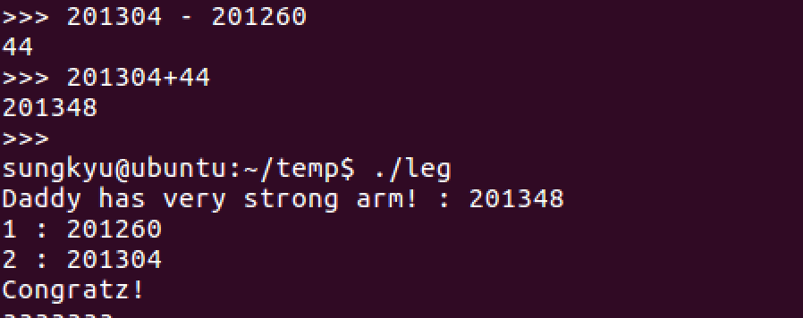
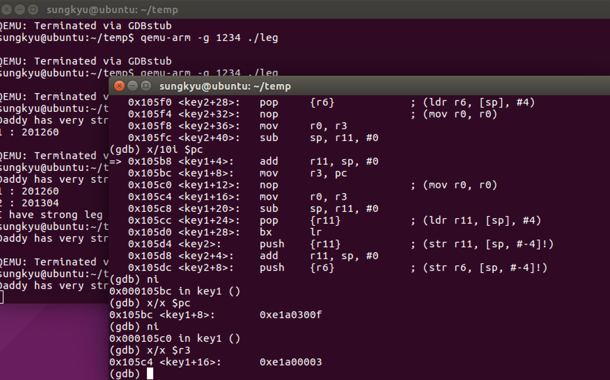

## 2017.7.27.
## Sungkyu Cho - sungkyu1.cho@gmail.com

PWNABLE KR - TODDLER - leg - 2pt

ARM에 대해서는 x86보다는 많이 본 편이었지만(예전에 mobile exploit 분석하느라 울며 겨자먹기 식으로 조금 공부..) 생각보다는 어렵게 풀었다. ~~역시 2점짜리 문제는 1점짜리보다 2배 어려워~~

ARM에서 ```r0```가 리턴값을 저장하고 swi나 system call은 ```r7```에서 수행된다는 점 정도는 알고 있음

관련한 내용은 아래 링크 참조. 예전에 이승진 사장님이 알려준 사이트인데, 이거보다 좋은 레퍼런스를 찾기도 힘듬..
[ARM shellcode - Shellstorm](http://shell-storm.org/blog/Shellcode-On-ARM-Architecture/)

# 0.우선은 소스코드 살펴보기
  파일은 2개가 주어지는데, 첫 번째 파일은 text 형식으로 leg.asm이 주어지고, 두번째는 inline asm이 포함되어 있는 leg.c 파일이다.

  ```c
  int main(){
        int key=0;
        printf("Daddy has very strong arm! : ");
        scanf("%d", &key);
        printf("key : %x\n", key1()+key2()+key3());
        if( (key1()+key2()+key3()) == key ){
                printf("Congratz!\n");
                int fd = open("flag", O_RDONLY);
                char buf[100];
                int r = read(fd, buf, 100);
                write(0, buf, r);
  ```
  위에서와 같이 입력된 값이 inline asm의 결과값만 같으면 통과되는 문제인데 솔직히 아주 쉽게 생각했다. 이유는, ```printf()```로 찍어보면 되겠구나~~ 해서 얼른 qemu와 arm-gdb를 설치했음

  ```
   $ sudo apt-get install qemu
   $ sudo apt-get install arm-linux-eabi-gcc
   $ sudo apt-get install arm-none-eabi-gdb
   ...
  ```

  결론적으로 이 방법은 실패했는데, 아래 그림과 같이 값(key1()+key2()+key3)이 계속 이동하고 있었기 때문임.

  

  즉, 뭔가 리턴값이 주소와 관계된 것이라는 것을 알고 이 때부터 본격적인 분석작업 시작..

# 1.Check it up

  * asm 코드는 생각보다 복잡한 것은 없음
  * ```key1()``` - 결국 ```$pc```를 ```$r0```에 넣는 것이므로 ```$pc``` 값을 찾으면 됨
  ```c
  0x00008cd4 <+0>:     push    {r11}           ; (str r11, [sp, #-4]!)
0x00008cd8 <+4>:     add     r11, sp, #0
0x00008cdc <+8>:     mov     r3, pc
0x00008ce0 <+12>:    mov     r0, r3
0x00008ce4 <+16>:    sub     sp, r11, #0
0x00008ce8 <+20>:    pop     {r11}           ; (ldr r11, [sp], #4)
0x00008cec <+24>:    bx      lr
  ```

  * ```key2()``` - 다소 복잡해보이지만, ```$pc```를 ```$r3```에 넣고, 4를 더한 후 ```$r0```에 넣으므로 이것도 ```$pc``` 찾는 게 핵심
  ```c
  0x00008cf0 <+0>:     push    {r11}           ; (str r11, [sp, #-4]!)
0x00008cf4 <+4>:     add     r11, sp, #0
0x00008cf8 <+8>:     push    {r6}            ; (str r6, [sp, #-4]!)
0x00008cfc <+12>:    add     r6, pc, #1
0x00008d00 <+16>:    bx      r6
0x00008d04 <+20>:    mov     r3, pc
0x00008d06 <+22>:    adds    r3, #4
0x00008d08 <+24>:    push    {r3}
0x00008d0a <+26>:    pop     {pc}
0x00008d0c <+28>:    pop     {r6}            ; (ldr r6, [sp], #4)
0x00008d10 <+32>:    mov     r0, r3
0x00008d14 <+36>:    sub     sp, r11, #0
0x00008d18 <+40>:    pop     {r11}           ; (ldr r11, [sp], #4)
0x00008d1c <+44>:    bx      lr
  ```

  * ```key3()``` - link register(```$lr```) 값이므로 리턴 이후 값만 찾으면 됨
  ```c
   0x00008d20 <+0>:     push    {r11}           ; (str r11, [sp, #-4]!)
   0x00008d24 <+4>:     add     r11, sp, #0
   0x00008d28 <+8>:     mov     r3, lr
   0x00008d2c <+12>:    mov     r0, r3
   0x00008d30 <+16>:    sub     sp, r11, #0
   0x00008d34 <+20>:    pop     {r11}           ; (ldr r11, [sp], #4)
   0x00008d38 <+24>:    bx      lr
   ```

  * 따라서, leg.asm 파일에 주어진 주소를 기반으로 ```key1, key2, key3``` 값이 각각 ```0x8ce0, 0x8d0c, 0x8d80``` 으로 보아 합한 후 답을 입력하였지만 답이 안나옴.. 뭔가 이상하다 싶어서 아래와 같이 동적분석 시도

  * qemu와 gdb를 연결하고 c 파일을 컴파일하여 동적분석을 시작

  ```
  (gdb server)
  sungkyu@ubuntu:~/temp$ qemu-arm -g 1234 ./leg
  ```
  ```
  (gdb client)
  sungkyu@ubuntu:~/temp$ arm-none-eabi-gdb
  ...
  (gdb) file leg
  (gdb) target remote :1234
  ```



* 한참을 디버깅을 하는데, 문제는 엉뚱한 곳에서 찾았다. 지금까지 ```$pc```는 그냥 다음에 수행할 명령어의 주소로 알고 있었는데..
* 아래와 같이 **다음다음 주소를 참조하는 경우** 가 있었던 것이다. (아래는 ```$pc```가 저장된 시점이 0x105ea이기 때문에 ```0x105ea```가 저장되었을 것으로 예측했는데 실제로 ```$r3```에 저장된 것은 ```0x105ec```인 상황임)

  ```
  (gdb) x/3i $pc-2
     0x105e8 <key2+20>:	mov	r3, pc
  => 0x105ea <key2+22>:	adds	r3, #4
     0x105ec <key2+24>:	push	{r3}

  0x000105ea in key2 ()
  (gdb) x/x $r3
     0x105ec <key2+24>:	0xbd00b408

  (gdb)

  ```

  * 내가 ```$pc```에 저장되는 방법을 잘 모르나 싶어서 구글에 ```ARM mov pc register```라고 검색하니 첫 결과에 답이 나왔음
  * [ARM에서 pc 저장 관련 stackoverflow 답변](https://stackoverflow.com/questions/24091566/why-does-the-arm-pc-register-point-to-the-instruction-after-the-next-one-to-be-e)

```
    In ARM state, the value of the PC is
    the address of the current instruction
    plus 8 bytes.

    In Thumb state:

        For B, BL, CBNZ, and CBZ instructions,
        the value of the PC is the address of
        the current instruction plus 4 bytes.

        For all other instructions that use
        labels, the value of the PC is the
        address of the current instruction plus
        4 bytes, with bit[1] of the result
        cleared to 0 to make it word-aligned.

```

  * 즉, **ARM mode에서는 pc+8 이, thumb mode에서는 pc+4** 라는 이야기이며, ARM mode와 thumb mode를 구분하는 방법은 ```$CPSR``` (Current Program Status Register)레지스터를 통해 가능함
  * [CPSR 관련 참조 링크](http://recipes.egloos.com/5032032) :  ```CPSR```의 5 번째 bit가 1이면 thumb mode이고, 0이면 ARM mode 라는 이야기
  * 실제 동적분석을 통해 확인해본 결과
    - ```Key1()``` : ARM mode (즉 현재주소+8)
    - ```Key2()``` : Thumb mode (즉, 현재주소+4)
    - ```Key3()``` : 확인 불필요, ```$lr```만 있으면 됨

# 2. 결과값 계산

  * ```Key1()```
    - ```$pc```를 ```$r3```에 저장하는 단계가 ```0x00008cdc```이므로 여기에 8(ARM mode)을 더하면 ```0x8CE4```
  * ```Key2()```
     - ```$pc```를 ```$r3```에 저장하는 단계가 ```0x00008d04```이므로 여기에 4(Thumb mode)를 더하면 ```0x8d08```인데, 4를 더하는 단계가 한번 더 있으므로 결론은 ```0x8d0c```
   ```
   0x00008d04 <+20>:    mov     r3, pc
   0x00008d06 <+22>:    adds    r3, #4
   ```
  * ```Key3()```
    - ```key3()```이후 리턴되는 주소이므로 ```0x8d80```
    ```
    0x00008d7c <+64>:    bl      0x8d20 <key3>
    0x00008d80 <+68>:    mov     r3, r0
    ```

  * 최종결론은 0x8ce4 + 0x8d0c + 0x8d80 = 0x1a770 = 108400

# 3. Exploit
  
